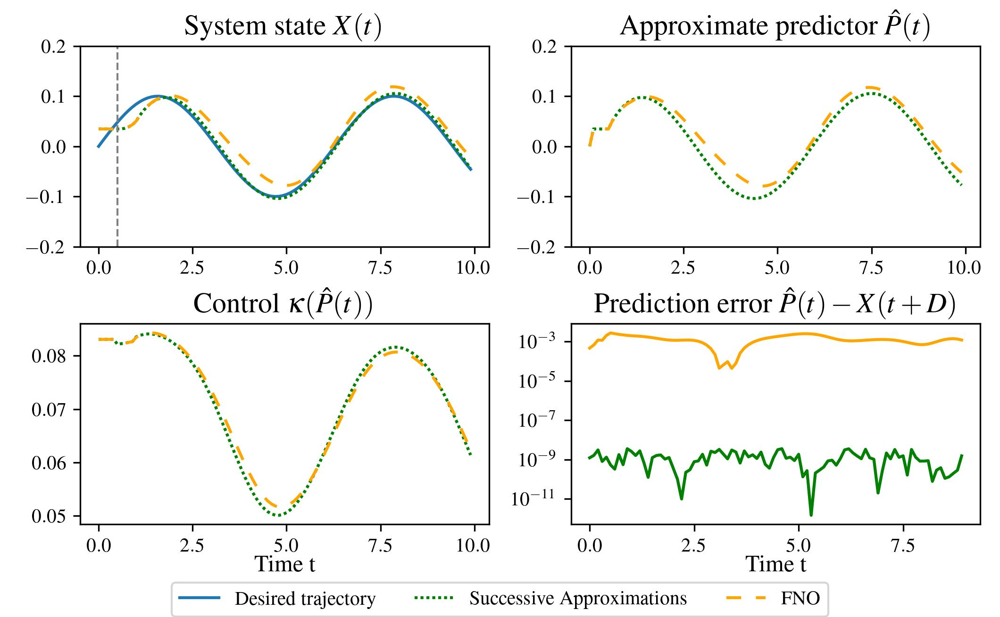

<div align="center">
  <a href="https://ccsd.ucsd.edu/home">
    
  </a>
  <a href="https://ucsd.edu/">
    
  </a>
</div>

<br> <br>

# Neural Operator Predictors for Delay-Compensated Nonlinear Stabilization
<div align="center">
 <a href="#"></a>
</div>


[Paper](https://arxiv.org/pdf/2411.18964 |
[GitHub](https://github.com/lukebhan/NeuralOperatorPredictorFeedback) |
[arXiv](https://arxiv.org/pdf/2411.18964 |
Published in L4DC 2025 (Oral) + Submitted to IEEE TAC.

## Introduction

This repository is the official implementation for the papers titled "Neural Operator Predictors for Delay-Compensated Nonlinear Stabilization" and "Neural Operators for Predictor Feedback Control of
Nonlinear Delay Systems". Please refer to the example below for a quick notebook reproducing the paper results. We have included pretrained datasets and models as well as the code to train
one's own models and dataset if interested. 

Note, since the original L4DC publication, these result have been improve and updated to the latest packages as of May 2025. Thus, the direct numerical values may differ slightly from those published in
the paper, but the overall result remains the same. 

## Getting Started - Installation, Package Versioning, Datasets, and Models.
- To get started, please setup your virtual envrionment ([Virtual Env tutorial](https://packaging.python.org/en/latest/guides/installing-using-pip-and-virtual-environments/)) and install the corresponding packages and versions given in `requirements.txt`.
- Additionally, we have published both the dataset and models on huggingface. Please clone the repositories below following the instructions on huggingface and place the resulting
files in the dataset and models folders of this repository (See below for structure). 
  - [Hugging face: Dataset](https://huggingface.co/datasets/lukebhan/NeuralOperatorsPredictorFeedbackDataset)
  - [Hugging face: Models](https://huggingface.co/lukebhan/NeuralOperatorsPredictorFeedbackModels)
 
    
<br>

   >The repository directory should look like this:
  ```
  NeuralOpertorPredictorFeedback/
  ├── examples/
  ├── src/
  ├── config/
  ├── datasets/ # Place the cloned datasets here
  │   ├── ManipulatorDatasets/    
  │   ├── UnicycleConstDelayDataset/   
  │   ├── UnicycleTimeVaryingDelayDataset/
  ├── models/ # Place the cloned models here
  │   ├── ManipulatorModels/    
  │   ├── UnicycleConstDelayModels/   
  │   ├── UnicycleTimeVaryingDelayModels/
  ├── media/ 
  •   •   •
  •   •   •
  ```


# Unicycle Example - Constant and Time-Varying Delays
See `examples` folder for two notebooks that have implementations of neural operator predictors for both constant and time-varying delays for the
unicycle system. These models are quick to train and thus can be run with any modern GPU system (and higher end laptops). 
we provide both pretrained models as well as the corresponding datasets to make your own at 
- [Dataset](https://huggingface.co/datasets/lukebhan/generalizableMotionPlanning)
- [Models](https://huggingface.co/lukebhan/generalizableMotionPlanningViaOperatorLearning)


### Citation 
If you found this work useful or interesting for your own research, we would appreciate if you could cite our work:
```
@misc{bhan2025neuraloperatorspredictorfeedback,
      title={Neural Operators for Predictor Feedback Control of Nonlinear Delay Systems}, 
      author={Luke Bhan and Peijia Qin and Miroslav Krstic and Yuanyuan Shi},
      year={2025},
      eprint={2411.18964},
      archivePrefix={arXiv},
      primaryClass={eess.SY},
      url={https://arxiv.org/abs/2411.18964}, 
}
```

### Licensing
<a rel="license" href="http://creativecommons.org/licenses/by-nc-sa/4.0/"></a><br />This work is licensed under a <a rel="license" href="http://creativecommons.org/licenses/by-nc-sa/4.0/">Creative Commons Attribution-NonCommercial-ShareAlike 4.0 International License</a>.

